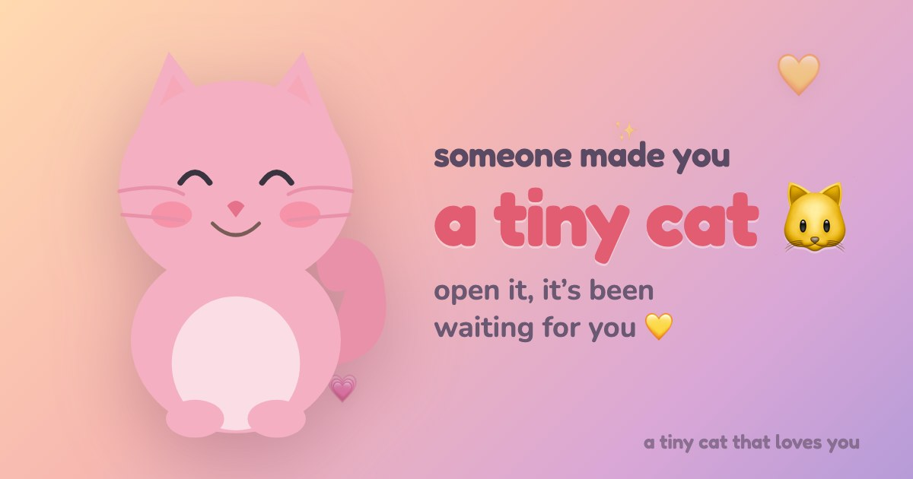

# 🐱 A Tiny Cat That Loves You

A little cat that remembers you and saves a smile for when you come back. Make
one for someone you love and send it as a single link. No backend, no accounts,
nothing to install.

**[ ▶ Live demo ](https://nodesaint.github.io/tiny-creatures-love-you/)**



## What it does

- **Make a cat.** Pick a colour, name it, write your own sweet things and inside
  jokes, add special days like birthdays. You get a link to share.
- **They open it.** The cat greets them by name and is happy to see them.
- **It remembers.** Come back after a while and it reacts: *"I missed you"*,
  *"you were gone 3 days… I saved a smile for you."*
- **Pet it** (tap the cat) and **feed it compliments** (type something sweet) to
  cheer it up. It purrs, bursts hearts, and talks back.

## How it works

- 100% static: plain HTML/CSS/JS, runs anywhere, perfect for GitHub Pages.
- All personal data is packed into the URL **fragment** (after `#`). Browsers
  never send the fragment to any server, so your private notes can't leak.
- The cat's mood/memory lives in the recipient's `localStorage`, keyed per link.
- One tiny vendored dependency: [`lz-string`](https://github.com/pieroxy/lz-string)
  (~5KB) to keep the link short.

## Run it locally

It's static, so any web server works (a server is needed because it uses ES
modules — opening `index.html` via `file://` won't load them):

```bash
python3 -m http.server 8000
# then open http://localhost:8000
```

## Deploy to GitHub Pages

1. Push this repo to GitHub.
2. **Settings → Pages → Build and deployment → Source: Deploy from a branch.**
3. Pick the `main` branch, `/ (root)` folder, save.
4. Your site goes live at `https://<username>.github.io/<repo>/`.

## Make your own version

Just open the live site — the create form does everything. No code needed.
To customize the built-in cat lines, edit [`js/messages.js`](js/messages.js).

## Project layout

```
index.html            page shell + both views
css/style.css         all styles (the living dusk sky lives here)
js/main.js            router: create mode vs pet mode
js/creator.js         the "make a cat" form + live preview
js/pet.js             brings a cat to life (greeting, petting, feeding)
js/cat.js             the SVG cat: shapes, moods, animations, hearts
js/state.js           localStorage memory + happiness decay
js/messages.js        the cat's built-in lines
js/share.js           encode/decode a gift to/from the URL
vendor/lz-string.min.js
```

## License

MIT — make cats, send love.
